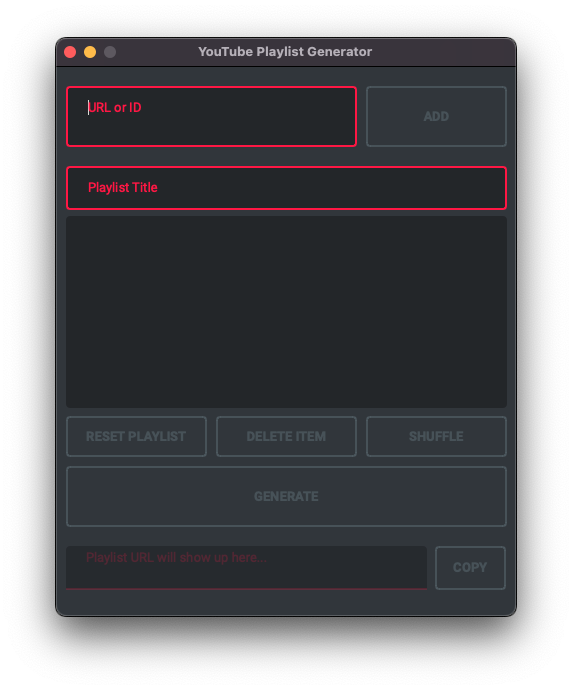
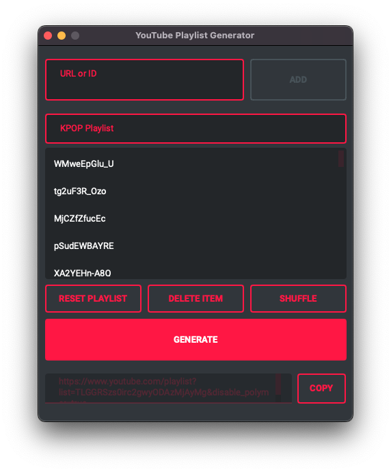

<a href="https://github.com/christianhofmanncodes/youtube-playlist-generator">
    
</a>

# YouTube Playlist Generator


A fun program based on Python to generate YouTube Playlists without an account.

## Appendix

This project contains both a console and a GUI version.
Choose the version to your likings.

## Features

- Add URL or ID
- Specify playlist title
- Clear playlist (deletes all items in playlist)
- Delete specific items
- Generate playlist URL
- Open generated URL automatically in default Web Browser
- Copy URL to clipboard
- Import .ytplaylist file
- Export to .ytplaylist file

## Screenshots

### First start



### After YouTube Playlist generation



## Installation

Just download and run the newest version from the Releases.
Select your file accordingly to the OS (Windows, Linux or macOS) you are running.

Start the program. Now you can either create a new playlist by adding a URL or ID one by one to the playlist or you can import a `.ytplaylist` file. If you want to save your playlist you can export the playlist with all its items and playlist title to a `.ytplaylist` file. Hand it over to a friend, if you want.

## Run Locally

Clone the project

```bash
  git clone https://github.com/christianhofmanncodes/youtube-playlist-generator.git
```

Go to the project directory

```bash
  cd youtube-playlist-generator
```

Install Python

```bash
  pip install python
```

Install dependencies

```bash
  pip install pandas
  pip install pyqt6
  pip install qt_material
```

Run the app (console-version)

```bash
  python src/console/app.py
```

Run the app (GUI-version)

```bash
  python src/gui/app-gui.py
```

Note: On Linux and macOS you need to use `pip3` and `python3`.  
3rd step is only necessary if you want to use the console version. Otherwise you can skip that step.

## Roadmap

- Change order of playlist items

- Add keyboard shortcuts

- Change program languge in settings (English/Deutsch)

## FAQ

#### How did you came up with this project?

A friend of mine actually wanted to build a YouTube playlist together with me. But I had no idea how to do it because I don't have a Google account and I didn't wanted to create one either. So I've came up with the idea to create a little program that could handle it.

#### Which type of links are supported?

The program supports both YouTube and Invidious links of any instance.

```
https://www.youtube.com/watch?v=
https://www.youtu.be/
https://invidious.namazso.eu/watch?v=
```

## Acknowledgements

- [Python](https://github.com/python/)
- [Qt6](https://doc.qt.io/qtforpython-6/index.html)
- [PyQt6](https://www.riverbankcomputing.com/software/pyqt/)
- [Qt-Material](https://github.com/UN-GCPDS/qt-material)

## Contributing

Contributions are always welcome!

See `contributing.md` for ways to get started.

You can report any issues and are welcome to create pull requests.
Please use the labels accordingly: `bug` for bugs, `documentation` for improvements to the documentation and `enhancement` for feature requests.

## License

This code is free software licensed under the [GPL v3.0](https://choosealicense.com/licenses/gpl-3.0/). See the LICENSE file for details.

## Feedback

If you have any feedback, please reach out to me at christianhofmann@mail.de
