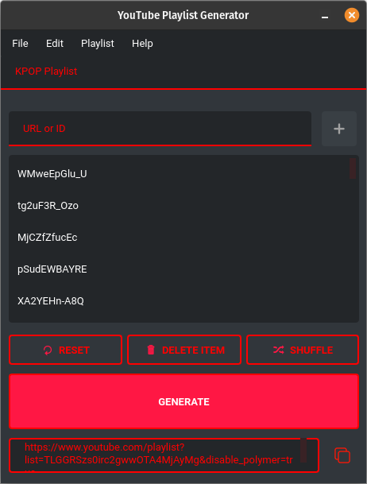

# YouTube Playlist Generator


A fun program based on Python to generate YouTube playlists without an account.  

## Please note

This project originally contained both a console and a GUI version.
As of version 0.0.5, the console version will no longer be developed.

## Features

- Add URL or ID
- Specify playlist title
- Reset playlist (deletes all items in the playlist)
- Playlist Tools (Count items, Clear all items, Remove duplicates)
- Sort items (Ascending & Descending)
- Rename specific items
- Change order of playlist items
- Delete specific items
- Shuffle-mode
- Generate playlist URL
- Automatically open generated URL in default web browser
- Copy URL to clipboard
- Open .ytplaylist file
- Save .ytplaylist file

## Screenshots

### First start

| Windows                                                       | Linux                                                     | macOS                                                   |
| ------------------------------------------------------------- | --------------------------------------------------------- | ------------------------------------------------------- |
|  |  |  |

### With items added

| Windows                                                            | Linux                                                          | macOS                                                        |
| ------------------------------------------------------------------ | -------------------------------------------------------------- | ------------------------------------------------------------ |
|  |  |  |

### After YouTube Playlist generation

| Windows                                                                     | Linux                                                                   | macOS                                                                 |
| --------------------------------------------------------------------------- | ----------------------------------------------------------------------- | --------------------------------------------------------------------- |
|  |  |  |

## Installation

Just download and run the newest version from the Releases.
Choose your file according to the operating system (Windows, Linux or macOS) you are using.

Launch the program. Now you can either create a new playlist by adding an URL or ID to the playlist one by one, or you can open a `.ytplaylist` file. If you want to save your playlist, you can save the playlist to a `.ytplaylist` file with all its items and the playlist title. Share it with a friend if you want.

## Run Locally

Clone the project

```bash
  git clone https://github.com/christianhofmanncodes/youtube-playlist-generator.git
```

Go to the project directory

```bash
  cd youtube-playlist-generator
```

Install Python

```bash
  pip install python
```

Install dependencies

```bash
  pip install -r requirements/base.txt
```

Run the app

```bash
  fbs run
```

Note: On Linux and macOS you have to use `pip3` and `python3`.  
Pandas only needs to be installed if you want to use the console version.

## Known issues & possible fixes

If you have any issues with running the program please first check your python version.
Minimal version required is `Python 3.9.5`.

### Cannot build because libpython3.9 is missing

`sudo apt-get install libpython3.9-dev`

### /lib/x86_64-linux-gnu/libc.so.6: version \`GLIBC_2.33' not found”

```bash
sudo add-apt-repository ppa:ubuntu-toolchain-r/test
sudo apt-get update
sudo apt-get install gcc-4.9
sudo apt-get upgrade libstdc++6
```

### PyQt6 cannot be installed via pip

```bash
pip3 install --upgrade pip
pip3 install PyQt6
```

### Failed to extract PyQt6/Qt6/plugins/egldeviceintegrations/libqeglfs-emu-integration.so: failed to open target file! fopen: No such file or directory

`export QT_QPA_EGLFS_FB=/dev/fbX`

### INTERNAL ERROR: cannot create temporary directory

You do not have enough space on your system.
Simply free up some space.

## Roadmap

- Change program language in settings (English/Deutsch)
- Darkmode & Whitemode (switchable in settings)

## FAQ

### How did you come up with this project?

A friend of mine wanted to build a YouTube playlist with me. But I had no idea how to do it because I don't have a Google account and I didn't want to create one either. So I came up with the idea to develop a neat little program that could do that.

### What types of links are supported?

The program supports both YouTube and Invidious links of any type.

```bash
https://www.youtube.com/watch?v=
https://www.youtu.be/
https://invidious.namazso.eu/watch?v=
```

## Acknowledgements

- [Python](https://github.com/python/)
- [Qt6](https://doc.qt.io/qtforpython-6/index.html)
- [PyQt6](https://www.riverbankcomputing.com/software/pyqt/)
- [Qt-Material](https://github.com/UN-GCPDS/qt-material)
- [fbs](https://build-system.fman.io/)

## Contributing

Contributions are always welcome!

See `CONTRIBUTING.md` for ways to get started.

You can report any issues and are welcome to create pull requests.
Please use the labels accordingly: `bug` for bugs, `documentation` for improvements to the documentation and `enhancement` for feature requests.

## License

This code is free software licensed under the [GPL v3.0](https://choosealicense.com/licenses/gpl-3.0/). See the LICENSE file for details.

## Feedback

If you have any feedback, please reach out to me at: contact@youtube-playlist-generator.com
